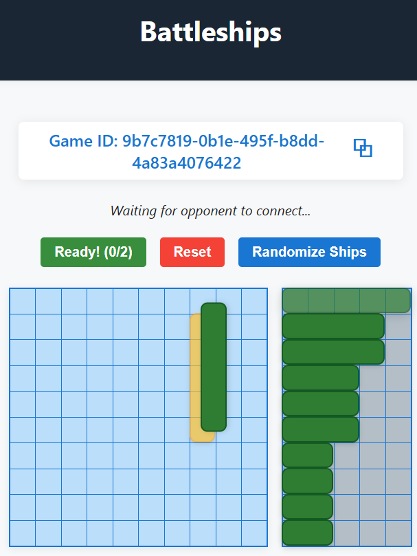
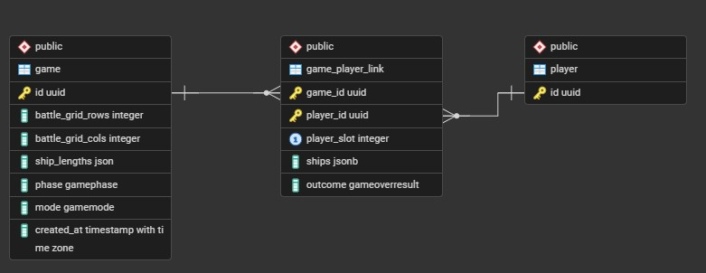

# Battleships

A full-stack, real-time Battleships web-app built with FastAPI, React, PostgreSQL and Protocol Buffers. The project is deployed as a monolith where the frontend single-page-application is served via the backend. The project is containerised with Docker for easy deployment, but also allows seamless local development.

## 🚀 Quick Start

You can play with your friends by deploying your own instance of the game server.
To do so without setting up a whole development environment:

1. If not done already, install [Docker Desktop](https://www.docker.com/products/docker-desktop/).
2. Open Docker Desktop, if needed login/sign up, and ensure it's running.
3. Run the following command in your terminal (for further configuration/information esp. regarding the DB, see the [Development](#development-setup) section):

   ```bash
   curl -sL https://raw.githubusercontent.com/MarlonF24/battleships/refs/heads/main/docker-compose.yml | docker compose -f - up
   ```

4. Open your browser and navigate to `http://localhost:8000`.
For your friends in the same private network to join your game, share your private network IP address (e.g., `192.168.x.x:8000`).
You can find your local IP address by running `ipconfig` (Windows) or `ifconfig` (Mac/Linux) in your terminal.

5. Enjoy playing Battleships!



## 🛠️ Tech Stack & Architecture

This project is built with a focus on **end-to-end type safety** and **asynchronous performance**.


### Backend
|      |
| :--- |
| **Python 3.10+**: Core backend language. Extendable for potential machine learning features in the future. |
| **FastAPI + Pydantic**: Allows for a unified server to handle both RESTful requests and WebSocket connections while ensuring type-safe data models. |
| <details><summary><b>PostgreSQL (SQLAlchemy)</b>: Relational database to enforce constraints on player-game data. Used SQLAlchemy for ORM features and asyncio integration when using the <code>asyncpg</code> DB-Driver (Toggle for schema).</summary><br></details> |
| <details><summary><b>Asyncio</b>: Powers the FastAPI server on a single thread. Essential for efficient WebSocket handling (Toggle for details).</summary><ul><li><b>Message Routing</b>: Implemented using multiple queues and the producer-consumer pattern to deliver the different message channels/types to distinct handlers.</li><li><b>Communication Integrity</b>: Used locks, events and timeouts to enforce message order and handle disconnects/reconnects.</li></ul></details> |

### Frontend


|    |
| :--- |
| **TypeScript**: Core frontend language. |
| <details><summary><b>React</b>: Used the component-based architecture for the UI components (Toggle for further selected applications).</summary><ul><li><b>Navigation</b>: Used <b>React Router</b> for SPA routing.</li><li><b>Styling</b>: Used <b>styled-components</b> for CSS-in-JS.</li><li><b>Provider Pattern</b>: Used <b>React Contexts</b> for WebSocket delivery.</li></ul></details> |
| **Vite**: Selected as the build tool for its native integration with React and high-speed development cycle. |
| **MobX**: Used for more complex state management which was needed for the game logic. Allows OOP patterns that still integrate directly with React. |

### Shared / Cross-Cutting

|  |
| :--- |
| <details><summary><b>Protocol Buffers</b>: Used to design and generate type-safe, uniform WebSocket message schemas for the backend and frontend (Toggle for details).</summary><ul><li><b>Communication Channels</b>: Implemented envelope schemas to differentiate message domains: Server vs. Player, General (e.g., connection status) vs. Game-Phase specific.</li><li><b>Code Generation</b>: Used the default <code>protoc</code> compiler with specialized plugins: <code>betterproto</code> for Python and <code>protoc-gen-es</code> for TypeScript.</li></ul></details> |
| **OpenAPI Client Generation**: Leveraged the OpenAPI generator to auto-generate a type-safe TypeScript client, enabling simple, RPC-like interaction with FastAPI HTTP endpoints. |


## Development Setup
### Clone the Repo:
Navigate to your desired directory in the terminal and run:
```bash
git clone https://github.com/MarlonF24/battleships.git
```

### Database:
1. If you want to use a local DB, make sure you have [PostgreSQL](https://www.postgresql.org/download/) (v15+) installed on your machine.
2. Set up environment variables: 
   - Make sure you are at the root of the repo. Otherwise, navigate to it:
     ```bash
     cd path/to/battleships
     ```
   - Copy the `.env.example` file into a new `.env` file:
     ```bash
     cp .env.example .env
     ```
   - Follow the instructions in the `.env` file.


### Backend:
Make sure you have [Python](https://www.python.org/) (v3.10+) installed on your machine.
1. Navigate to the `backend` directory:
   ```bash
   cd path/to/battleships/backend
   ```
2. (Optional but recommended) Create and activate a virtual environment:
   ```bash
   python -m venv .venv
   source .venv/bin/activate  # On Windows use `.venv\Scripts\activate`
   ```
3. Install the required dependencies:
   ```bash
   pip install -r requirements.txt
   pip install -r requirements-dev.txt
   ```
4. Set up environment variables:
   - If not done already, follow the instructions in [Database](#database) to create a `.env` file.
   - Configure the backend-relevant variables as explained in the `.env` file.


### Frontend:
Make sure you have [Node.js](https://nodejs.org/) (v23.0+) installed on your machine.
1. Navigate to the `frontend` directory:
   ```bash
   cd path/to/battleships/frontend
   ```
2. Install the required dependencies:
   ```bash
   npm install
   ```
3. Set up environment variables:
   - Copy the **SEPARATE** frontend `.env.example` file into a new `.env` file:
     ```bash
     cp .env.example .env
     ```
   - Configure the variables as explained in the `.env` file.


### OpenAPI Generator:
Make sure you have the [OpenAPI Generator CLI](https://openapi-generator.tech/docs/installation/) installed on your machine.


### Protocol Buffers:
Make sure you have the Protocol Buffers compiler ([protoc](https://protobuf.dev/installation/)) installed on your machine (do not forget to add it to your system PATH).

### Docker (Optional):
- If you plan to run the application with Docker, also install:
[Docker Desktop](https://www.docker.com/products/docker-desktop/)
- If not done already, follow the instructions in [Database](#database) to create a `.env` file in the root directory. All relevant variables for Docker will be read from there.


## Development Workflow

### Backend:
Run the FastAPI development server with:
```bash
cd path/to/battleships/backend
fastapi dev controller.py
```

### Frontend:
Run the Vite development server with:
```bash
cd path/to/battleships/frontend
npm run dev
```

### OpenAPI Client Generation:
Run the OpenAPI generator with:
```bash
cd path/to/battleships
./code-gen.sh -a
```
This will regenerate the TypeScript OpenAPI client in the `frontend/src/base/api` directory.

> [!IMPORTANT]
> Always regenerate the OpenAPI client after making changes to the backend FastAPI HTTP endpoints!
> If you want to change the output directory, modify the path in the gen_api() function of the script.

### Protocol Buffers Schemas Generation:
Run the Protocol Buffers generation with:
```bash
cd path/to/battleships
./code-gen.sh -p
```
This will generate the python schemas in the `backend/games/websocket_models` directory and the TypeScript schemas in the `frontend/src/base/api/socketModels` directory.
> [!IMPORTANT]
> Always regenerate when you make changes to the `.proto` schema files!
> If you want to change the output directory, modify the corresponding paths in `buf.gen.yaml` and then also modify where they occur in `code-gen.sh`.

### Docker:
Make sure docker is running on your machine.

Build only the server image with:
```bash
cd path/to/battleships
docker build -t battleships-server .
```

Or build and run the whole application stack with:
```bash
cd path/to/battleships
docker compose up --build
```
> [!NOTE]
> The containerised DB will be available on `localhost:5433`

Reset the DB data by running:
```bash
cd path/to/battleships
docker compose down -v
```

Once the server build seems mature, you can push it to [Docker Hub](https://hub.docker.com/) or any other container registry of your choice by tagging and pushing the image:
```bash
docker tag battleships-server YOUR_DOCKERHUB_USERNAME/battleships-server:latest
docker push YOUR_DOCKERHUB_USERNAME/battleships-server:latest
```

You can then run the whole app with the just pushed image by running:
```bash
cd path/to/battleships
docker compose -f docker-compose.yml up
``` 

For others, share the `docker-compose.yml` file or follow the instructions in the [Quick Start](#-quick-start) section.


