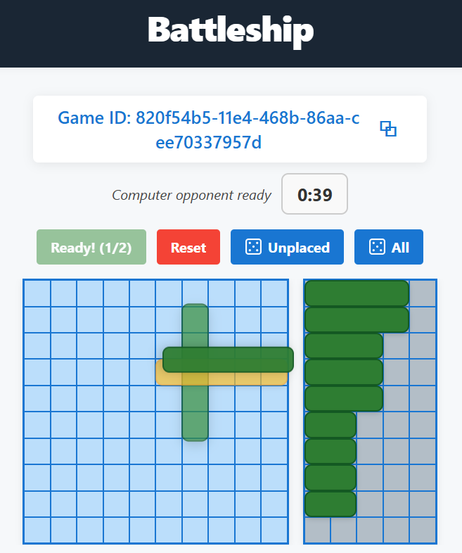

# Battleship

A full-stack, real-time Battleship game for friends, event game hubs, spectators, and a strong probability-density computer opponent. The compact interface keeps the character of the original project while working from phones in landscape through desktop screens.



The active application is a Bun workspace: React and MobX render complete server projections, Elysia owns live sessions, shared TypeScript packages define rules and wire contracts, and PostgreSQL stores identities, match metadata, results, and webhook delivery state.

## Identity and access

These terms are intentionally separate:

- An **Anonymous Player** is a browser-scoped standalone identity. The browser creates one UUID in local storage and reuses it for match-history attribution. Clearing browser data creates a new identity.
- A **Hub Player** is identified by a UUID supplied by the external game hub. Hub and anonymous UUIDs occupy different namespaces and are never correlated.
- A **Seat Token** is the secret UUID embedded in a player link. It authorizes control of exactly one human seat in one match. Anyone with that link can control the seat, so do not share player links.
- A **Spectator** is an unauthenticated, read-only live connection. A shareable match ID is enough to spectate; no spectator identity is stored.

The external hub owns accounts, Elo, and ranking. This service only reports ordered match outcomes.

## Quick start with Docker

Requirements: Docker with Compose.

```bash
cp .env.example .env
```

Set a real `DB_PASSWORD`, review the other explicit values, then start the stack:

```bash
docker compose up
```

Open `http://localhost:<SERVER_PORT>` (port `8000` by default). Compose pulls `ghcr.io/marlonf24/battleship:latest`, runs and publishes PostgreSQL on `DB_PORT`, then lets the application container synchronize the schema before starting its single server replica.

Pushes to `main` publish `latest` and a commit-specific tag to GitHub Container Registry. Tags such as `v1.2.3` additionally publish `1.2.3`, `1.2`, and `1`. Pull requests build the same multi-platform image without publishing it. The GHCR package must be public for unauthenticated Compose users; after its first publication, set its visibility to public in the package settings.

To intentionally discard the local development database and recreate the current schema:

```bash
docker compose down --volumes
docker compose up
```

This deletes local database data permanently.

## Local development

Requirements:

- Bun `1.3.9` (the pinned workspace/container version)
- PostgreSQL 17 running locally
- Docker for the container smoke test and the browser-test image

Configure `.env` for your local PostgreSQL instance, synchronize its schema when needed, then run the watched applications:

```bash
cp .env.example .env
bun install --frozen-lockfile
bun run db:push
bun run dev
```

`bun run dev` starts the API watcher and Vite concurrently without starting PostgreSQL or changing its schema. Your local PostgreSQL service must already be running. Run `db:push` after changing `apps/server/src/db/schema.ts` or creating a fresh local database. `SERVER_PORT` defaults to `8000`; `VITE_PORT` defaults to `5173` and proxies relative `/api` and WebSocket requests to the server port. Production serves the browser application and API from the same Bun server.

Open `http://localhost:<VITE_PORT>` while developing. Game routes ask narrow touch devices to rotate to landscape because ordinary browser pages cannot reliably lock screen orientation outside fullscreen.

The quality commands are:

```bash
bun run format:check
bun run lint
bun run typecheck
bun run test
bun run build
bun run test:e2e
bun run check
```

`bun run typecheck` uses the TypeScript 7 native compiler. The regular `typescript` package remains available as the compiler API required by ESLint and Vite tooling; application type checking does not fall back to it. The workspace enables VS Code's native TypeScript language service.

## Workspace map

```text
apps/web                 React, MobX, Tailwind CSS v4, browser routes
apps/server              Elysia HTTP/WS server, sessions, Drizzle persistence
packages/game-domain     Pure rules, placement, board transitions, PDF agent
packages/contracts       Strict TypeBox HTTP and WebSocket schemas
tests/e2e                Multi-viewport Playwright acceptance tests
docs                     Protocol, architecture, rules, and operations
```

## Deliberate runtime limitation

Accepted fleets, shots, deadlines, and active aggregates live only in one server process. They are not stored in PostgreSQL and are not restored after a crash or restart. On startup, every nonterminal database match becomes a premature `server_restart` result; affected hub matches receive a durable outbox event. Completed boards also disappear when their in-memory session is discarded, so a late spectator sees a clear unavailable state.

Run exactly one production server replica unless the live-session architecture is deliberately replaced.

## Documentation

- [Architecture and state ownership](docs/architecture.md)
- [Rules and timers](docs/rules.md)
- [HTTP and WebSocket protocol](docs/websocket-protocol.md)
- [Game-hub integration](docs/hub-integration.md)
- [Development guide](docs/development.md)
- [Deployment guide](docs/deployment.md)
